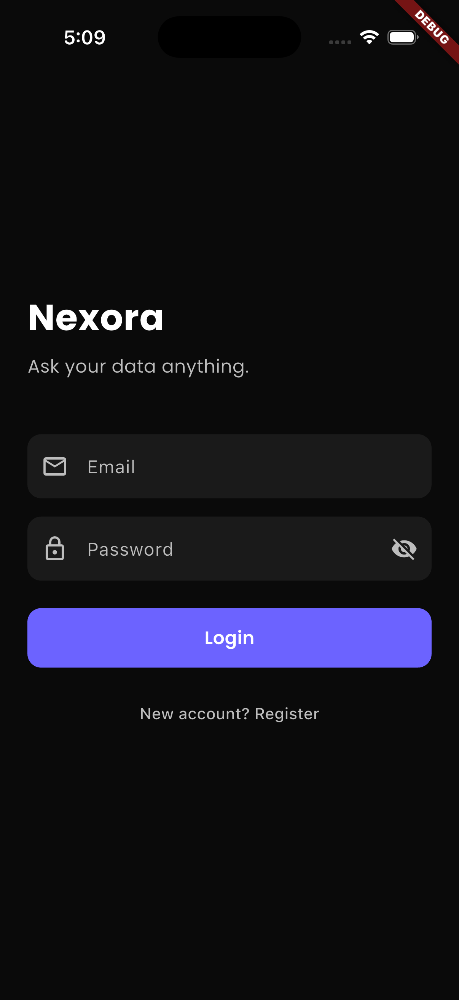
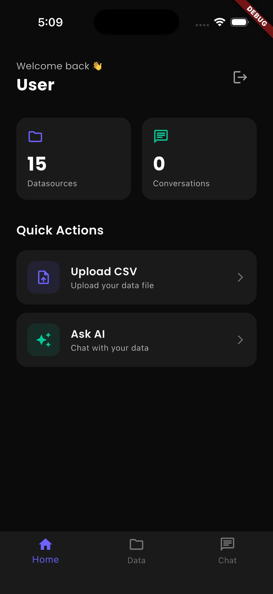
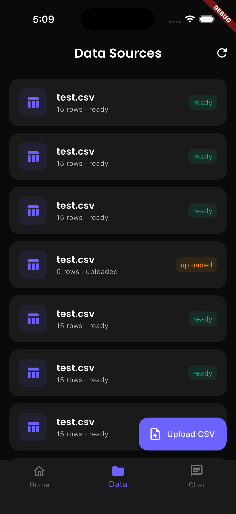
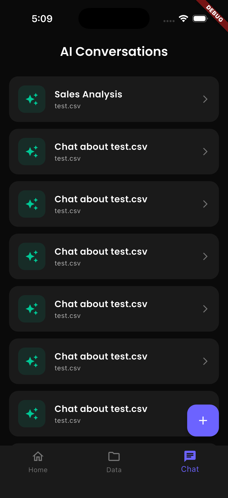
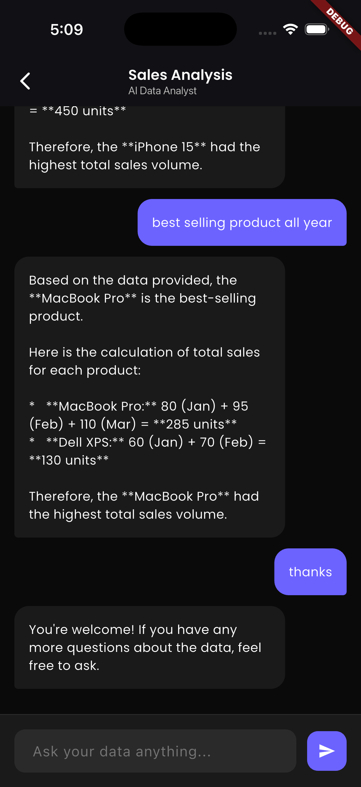

# Nexora — AI-Powered Data Intelligence Platform

> Upload your business data. Ask anything in plain language. Get instant AI-powered insights.

Nexora is a production-grade multi-tenant SaaS platform that enables non-technical teams to interact with their CSV data using natural language — powered by a custom RAG (Retrieval Augmented Generation) pipeline.

## Screenshots

<div align="center">
 
  
  
  
   
</div>

---

## User Stories

**As a Marketing Manager:**
> "I uploaded last quarter's sales CSV and asked *'Which product had the highest revenue in February?'* — Nexora answered instantly with exact numbers. No SQL, no waiting for analysts."

**As an Operations Head:**
> "I asked *'Which city had the most delayed deliveries?'* — the AI analyzed my logistics data and gave me a ranked list in seconds."

**As a Team Owner:**
> "I invited my team members, assigned roles, and now everyone can query our shared data — securely, without exposing raw files."

---

## Why Nexora over ChatGPT?

| Feature | ChatGPT | Nexora |
|---|---|---|
| Upload CSV | ✅ (loses after session) | ✅ Permanent storage |
| Large files (10k+ rows) | ❌ Context limit | ✅ Vector search |
| Team collaboration | ❌ | ✅ Multi-tenant |
| Data privacy | ❌ Sent to OpenAI | ✅ Your server |
| Role-based access | ❌ | ✅ OWNER/ADMIN/MEMBER |
| Conversation history | ❌ | ✅ Persistent |
| API integration | ❌ | ✅ REST API |

---

## Tech Stack

### Backend
| Layer | Technology | Purpose |
|---|---|---|
| Runtime | Node.js 20 + TypeScript | Type-safe production API |
| Framework | Express.js | REST API server |
| Auth | JWT (Access + Refresh tokens) | Stateless authentication |
| Primary DB | PostgreSQL 15 + pgvector | Relational data + vector search |
| Document DB | MongoDB | Conversation history |
| Cache | Redis (Upstash) | JWT blacklist, sessions |
| File Storage | AWS S3 / MinIO | CSV file storage |
| Validation | Zod | Runtime type validation |
| Security | Helmet, CORS, bcryptjs | API security |

### AI / RAG Pipeline
| Layer | Technology | Purpose |
|---|---|---|
| Embeddings | HuggingFace Inference API | Text → vectors (384 dims) |
| Embedding Model | sentence-transformers/all-MiniLM-L6-v2 | Semantic understanding |
| Vector Store | pgvector (PostgreSQL extension) | Similarity search |
| LLM | Groq API (openai/gpt-oss-20b) | Natural language answers |
| RAG Strategy | Custom pipeline | Context retrieval + generation |

### Frontend (Mobile)
| Layer | Technology | Purpose |
|---|---|---|
| Framework | Flutter (Dart) | Cross-platform mobile app |
| State Management | Riverpod | Reactive state |
| HTTP Client | Dio | API calls |
| Local Storage | SharedPreferences | Token persistence |
| File Upload | file_picker | CSV file selection |
| UI | Google Fonts, Material 3 | Modern dark theme |

### Infrastructure & DevOps
| Layer | Technology | Purpose |
|---|---|---|
| Container | Docker + Docker Compose | Local development |
| Registry | AWS ECR | Docker image storage |
| Compute | AWS ECS Fargate | Serverless containers |
| Database | AWS RDS (PostgreSQL) | Managed database |
| Cache | Upstash Redis | Managed Redis |
| Load Balancer | AWS ALB | Traffic distribution |
| CI/CD | GitHub Actions | Automated deployment |

---

## RAG Pipeline — How It Works

```
Step 1: CSV Upload
User uploads CSV → Stored in S3/MinIO
DB record created (datasource)

Step 2: Embedding (Indexing)
Each CSV row converted to text:
"product_name: iPhone 15, sales: 150, month: January"
        ↓
HuggingFace API → 384-dimensional vector
        ↓
Stored in PostgreSQL pgvector table

Step 3: Query (Retrieval)
User asks: "Best selling product?"
        ↓
Query → HuggingFace → query vector
        ↓
pgvector cosine similarity search
Top 5 most relevant rows retrieved

Step 4: Generation
Retrieved context + conversation history
        ↓
Groq LLM (openai/gpt-oss-20b)
        ↓
Natural language answer ✅

Step 5: Persistence
User message + AI answer saved to DB
Conversation history maintained
```

---

## Architecture

```
Flutter App (iOS/Android)
        ↓
AWS ALB (Load Balancer)
        ↓
AWS ECS Fargate (Node.js API)
    ↓           ↓           ↓           ↓
AWS RDS     MongoDB      Upstash     AWS S3
PostgreSQL   Atlas        Redis      (Files)
+ pgvector  (Chats)    (Sessions)
        ↓
HuggingFace API    Groq API
(Embeddings)       (LLM Chat)
```

---

## Multi-Tenancy & Security

```
Every organization's data is completely isolated:
→ org_id on every table
→ JWT contains orgId — injected by middleware
→ Every DB query filters by org_id
→ No cross-tenant data leakage

Role-Based Access Control:
OWNER  → Full access, invite members, delete org
ADMIN  → Manage members, upload data
MEMBER → View and query data only

JWT Security:
→ Access token: 15 minutes
→ Refresh token: 7 days
→ Logout: refresh token blacklisted in Redis
→ Token rotation on every refresh
```

---

## API Endpoints

```
Auth:
POST /api/auth/register     — Create account + organization
POST /api/auth/login        — Login, receive JWT tokens
POST /api/auth/refresh      — Rotate access token
POST /api/auth/logout       — Blacklist refresh token

Users:
GET  /api/users/me          — Get profile
PUT  /api/users/me          — Update profile

Organization:
GET  /api/org               — Org details + members
POST /api/org/invite        — Invite team member (OWNER/ADMIN only)

Data Sources:
POST /api/datasources/upload — Upload CSV file
GET  /api/datasources        — List all datasources

AI:
POST /api/ai/conversations       — Start new conversation
POST /api/ai/embed/:datasourceId — Embed CSV into vector store
POST /api/ai/chat                — Ask AI (RAG query)
GET  /api/ai/conversations       — List conversations
GET  /api/ai/conversations/:id/messages — Chat history
```

---

## Local Setup

```bash
# Clone
git clone https://github.com/sumit2393/Nexora.git
cd Nexora

# Start Docker services
docker compose -f infra/docker-compose.yml up -d

# Install dependencies
cd apps/api && npm install

# Environment
cp .env.example .env
# Fill in your keys

# Run
npm run dev
```

**Services started by Docker:**
- PostgreSQL + pgvector → localhost:5432
- MongoDB → localhost:27017
- Redis → localhost:6379
- MinIO (S3) → localhost:9000

---

## Environment Variables

```env
NODE_ENV=development
PORT=3000

# PostgreSQL
POSTGRES_HOST=localhost
POSTGRES_PORT=5432
POSTGRES_DB=nexora
POSTGRES_USER=your_user
POSTGRES_PASSWORD=your_password

# MongoDB
MONGO_URI=localhost

# Redis
REDIS_HOST=your_upstash_host
REDIS_PORT=6379
REDIS_PASSWORD=your_upstash_password

# JWT
JWT_ACCESS_SECRET=your_secret
JWT_REFRESH_SECRET=your_secret
JWT_ACCESS_EXPIRES_IN=15m
JWT_REFRESH_EXPIRES_IN=7d

# AWS / MinIO
AWS_ACCESS_KEY_ID=your_key
AWS_SECRET_ACCESS_KEY=your_secret
AWS_REGION=ap-south-1
AWS_S3_BUCKET=nexora-uploads
AWS_ENDPOINT=http://localhost:9000  # Remove for production

# AI
GROQ_API_KEY=your_groq_key
HUGGINGFACE_API_KEY=your_hf_key
```

---

## What Makes This Production-Grade

```
✅ Multi-tenant architecture — org-level data isolation
✅ JWT with Redis blacklisting — secure token management
✅ Custom RAG pipeline — not just API integration
✅ pgvector — no separate vector DB needed
✅ Dockerized — same environment everywhere
✅ AWS ECS Fargate — serverless, auto-scaling
✅ Role-based access control — enterprise ready
✅ Error handling — graceful failures
✅ Environment validation — Zod schema on startup
✅ Conversation persistence — full chat history
```

---

## License

MIT © 2026 Sumit Kumar

---

*Built to showcase production AI engineering skills — RAG pipeline, multi-tenant SaaS, cloud deployment, and mobile integration.*